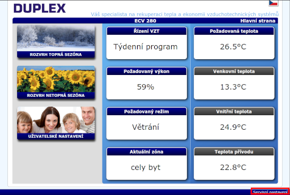
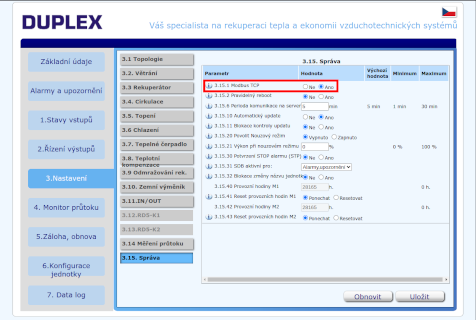

# Řízení rekuperační jednotky Atrea RD5

## Konfigurace automatizace

- [Home Assistant](homeassistant)

## Konfigurace jednotky

- Do webového prohlížeče zadejte IP adresu vaší jednotky Atrea a přihlašte se (výchozí heslo: pass)
- V pravém dolním rohu klikněte na odkaz Servisní nastavení

  

- Na kartě `3. Nastavení` zvolte podmenu `3.15. Správa` a přepněte parametry `3.15.1 Modbus TCP` na Ano
  

  (pokud nemáte přístup do servisního nastavení, kontaktujte autorizovaného servisního technika)

- Postupujte podle instrukcí dle zvolené automatizační platformy (viz výše)
