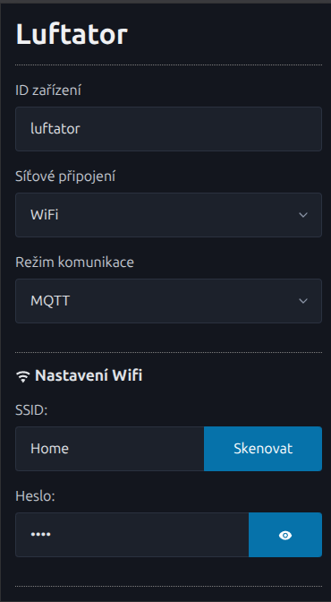
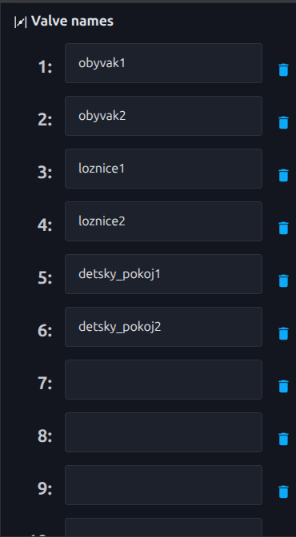

# Řízení zónovacího systému Luftator

## Konfigurace automatizace

- [Home Assistant](homeassistant)

## Konfigurace řídící jednotky

- Připojte řídící jednotku ke zdroji elektrické energie prostřednictvím adaptéru nebo PoE
- Podržte tlačítko na řídicí jednotce po dobu alespoň 5s dokud kontrolní dioda nezhasne, po uvolnění čekejte než začne kontrolní dioda rychle blikat
- Připojte se prostřednictvím mobilního telefonu, tabletu či notebooku k WiFi s názvem `luftator` (DŮLEŽITÉ: pokud se vám zobrazí upozornění, že v síti není k dispozici internet, potvrďte, že chcete zůstat připojeni k této síti, v některých případech je vhodné do dobu konfigurace vypnout mobilní data)
- Otevřete webový prohlížeč a zadejte adresu http://192.168.4.1/



- Zadejte název řídící jednotky (max. 16 znaků, pouze písmena anglické abecedy, čísla a podtržítka). Pokud budete mít ve své domácnosti více Luftatoru, zadejte např. `odvod` a `privod` nebo `patro1` a `patro2`.
- Vyberte, zda chcete Luftator připojit po Ethernetu či Wifi. Pro ethernet je vyžadováno automatické přidělování adres pomocí DHCP. Pro připojení po WiFi zvolte název Vaší místní WiFi sítě a zadejte heslo pro připojení k této síti.
- Vyberte režim komunikace MQTT nebo Modbus TCP, podle použité integrace.
- Pokud zvolíte režim komunikace MQTT, zadejte adresu použitého MQTT brokeru a jméno a heslo pro komunikaci s ním
- Volitelně je možné pojmenovat jednotlivé klapky. Pokud použijete integraci Home Assistant a zaškrtnete volbu `MQTT Home assistant discovery`, jednotlivé klapky se Vám automaticky zavedou v Home Assistantu v případě použití integrace přes MQTT.



- Potvrďte kliknutím na tlačítko `Uložit`
- Pokud je Vaše konfigurace správná, kontrolní dioda se po restartu řídící jednotky trvale rozsvítí. V opačném případě opakujte konfiguraci a ujistěte se, že vyplněné hodnoty jsou správné.

## Integrační rozhraní

### MQTT

Pro každou klapku je registrovány topicy s názvy, které začínají `<název zařízení>/valves/valve<číslo klapky>`, kde `<název zařízení>` odpovídá názvu zařízení nastaveném v konfiguraci a `<číslo klapky>` je hodnota 1-12, která odpovídá číslu uvedeném na konektorech řídící jednotky.
Hodnota, která je akutálně nastavena je v topicu `/state` a topic pro nastavení hodnoty je `/set`. Hodnota je vždy v rozsahu 0-90, kdy 0 odpovídá plně otevřené klapce a 90 plně zavřené.

Příklad topicu pro nastavení pozice `luftator/valves/valve1/set`.

Příklad provolání pro plné uzavření klapky 1:

```
mosquitto_pub -h mqtt-broker -u uzivatel -P heslo -t 'luftator/valves/valve1/set' -m '90'
```

### Modbus TCP

Modbus TCP rozhraní poslouchá na standardním portu 502 a disponuje 12 holding registry (Hreg) začínající adresou `0x4C00`. Každá hodnota obsahuje decimální určení polohy klapky, kdy 0 odpovída plně otevřené a 90 plně zavřené klapce.

| Holding register addr | Číslo klapky |
|-----------------------|--------------|
| 0x4C00                | 1            |
| 0x4C01                | 2            |
| 0x4C02                | 3            |
| 0x4C03                | 4            |
| 0x4C04                | 5            |
| 0x4C05                | 6            |
| 0x4C06                | 7            |
| 0x4C07                | 8            |
| 0x4C08                | 9            |
| 0x4C09                | 10           |
| 0x4C0A                | 11           |
| 0x4C0B                | 12           |

Pro zápis lze použít funkce `06` (WriteSingleRegister) a `15` (WriteMultipleRegisters).
Pro čtení lze použít funkce `03` (ReadHoldingRegisters).

