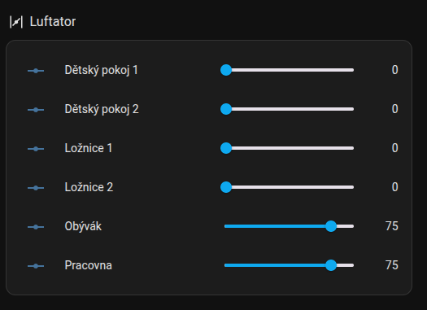

# HomeAssistant LUFTaTOR

Nastavení automatizace pro zónování LUFTaTOR přes platformu Home Assistant

- V [nastavení Luftatoru](../README.md) zvolte `MQTT` jako režim komunikace a zaškrtněte volbu `MQTT Home assistant discovery`
- Pokud jste ta doposud neučinili, nainstalujte podporu pro [mqtt](../../homeassistant/addons/mosquitto)
- Pokud nepoužijete volbu `MQTT Home assistant discovery` (nebo máte verzi Luftatoru menší než 1.1.0), můžete si jednotlivé klapky nadefinovat ručně podle souboru [configuration.yaml](configuration.yaml). Jednotlivé klapky si pojmenujte podle pokojů, do kterých vede potrubí, které každý klapka ovládá
- Nadefinujte si jednotlivé scény podle příkladu v souboru [scenes.yaml](scenes.yaml)
